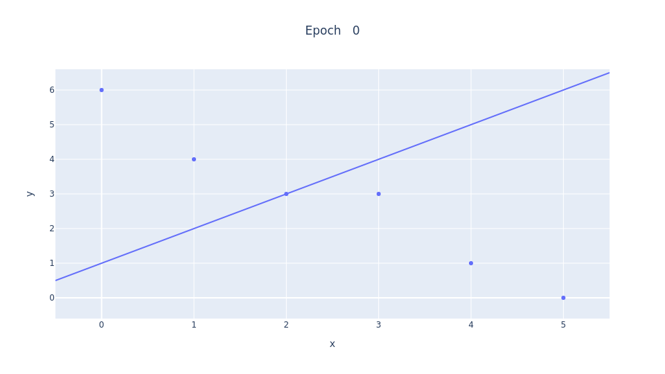

# Linear Regression with Gradient Descent
This program is a web application that displays an interactive graph, an implementation of linear regression (with one independent and one dependent variable) with gradient descent. It uses the Dash library, made by Plotly, which uses React.js and Plotly.js to create a Flask web application. Other tools used include Plotly, Materialize (CSS), pandas, NumPy, ImageIO, and OS.

Users can change the maximum number of iterations, or epochs, that the algorithm goes through, its learning rate, and even the points that it attempts to find a relationship for.

This project is optimized for uploading to Amazon Web Services, specifically for an Elastic Beanstalk Web Server application and environment. It is accessible [here](https://bit.ly/linreggd) (the environment may or may not be activated).

As for the code itself, I have used the 80-character standard to improve code readability. Each function has a description of what it does, and comments describe certain sections of code. The functions that are used during the calculation process are placed at near the top of the program while those used for the callback inputs of the interactive webpage are at the bottom of the code. The words 'epoch' and 'iteration' are used interchangeably in variable names and comments.

The cost function used is mean squared error. We try to minimize the cost by advancing the constant and coefficient values in the best-fit line (LSRL) in the right direction. This is what gradient descent does: it steps in the direction of the global minimum each iteration until it converges.

If the learning rate is too high, convergence will not happen.

 

*Max Epochs: 100, Learning Rate: 0.2*

The learning rate can still be too high even if the gradient descent converges. In this case, the algorithm will repeatedly overshoot the minimum until it gets close to it.

 
*Max Epochs: 100, Learning Rate: 0.1*

On the other hand, a learning rate that is too low will cause convergence to happen in an unreasonably long amount of time.

 
*Max Epochs: 100, Learning Rate: 0.01*

Therefore, we want to find a learning rate that causes the gradient descent to converge quickly and efficiently.

 
*Max Epochs: 100, Learning Rate: 0.08*
